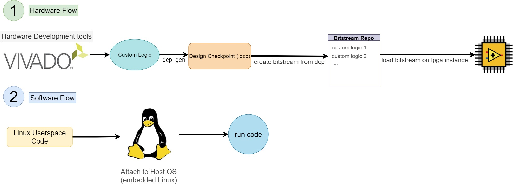
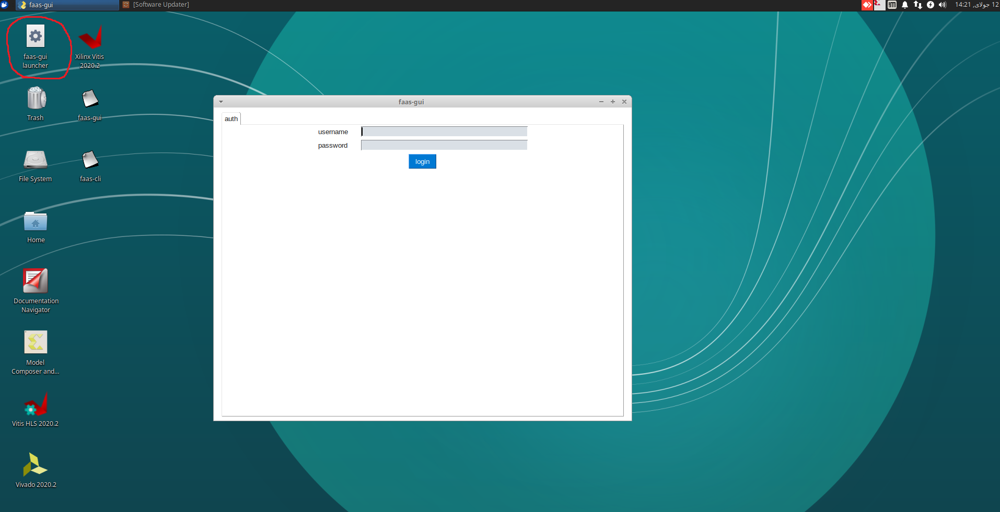

# Table of Contents
1. [Overview of Avan FPGA-as-a-service Development Kit](#overview-of-avan-fpga-as-a-service-development-kit)
    - [Development Flow](#development-flow)
2. [Getting Started](#getting-started)
3. [Debugging](#debugging)

# Overview of Avan FPGA-as-a-service Development Kit

Avan FaaS Development Kit is a set of development and runtime tools to design, synthesize and run hardware accelerated applications on Avan's FPGA instances. At the current version of the platform the Development tools are provided on a VM linux workspace and there is no need to install it on your own machines.

## Development Flow
The flow to design and run your hardware on the avan fpga platform is described in the below image. You need to proceed through both flows respectively.

In the hardware flow, first you create your FPGA design (also called Custom logic), and then you generate a design checkpoint from the design. After that a bitstream is generated for your design and is added to your bitstream repository, from where you can access it anytime. Finally you can load this bitstream in a FPGA instance.
In the software flow, you first write a userspace program which will be running on a host CPU connected to the FPGA fabric. Then you attach to the linux OS running on this CPU and finally you run your code on the host cpu and access your dedicated memory or fpga logic from the proccessing system.

# Getting Started
In order to start using the development kit, you first need to connect to a linux VM. Instructions for this part are provided by Avan's support staff.
1. After successfully conneting to your VM, open the 'faas-gui-launcher' and login using your credentials.

2. 
