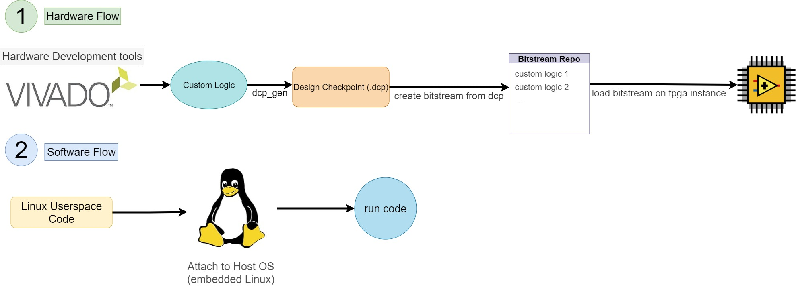
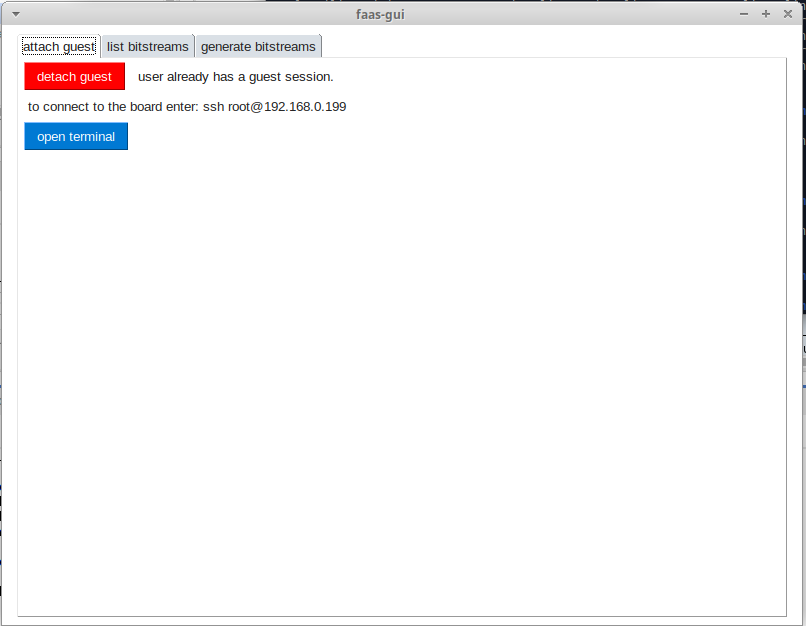

# Table of Contents
1. [Overview of Avan FPGA-as-a-service Development Kit](#overview-of-avan-fpga-as-a-service-development-kit)
    - [Development Flow](#development-flow)
2. [Getting Started](#getting-started)
    - [Hardware Flow](#hardware-flow)
    - [Software Flow](#software-flow)
3. [Debugging](#debugging)


# Overview of Avan FPGA-as-a-service Development Kit

Avan FaaS Development Kit is a set of development and runtime tools to design, synthesize and run hardware accelerated applications on Avan's FPGA instances. At the current version of the platform the Development tools are provided on a VM linux workspace and there is no need to install it on your own machines.

## Development Flow
The flow to design and run your hardware on the avan fpga platform is described in the below image. You need to proceed through both flows respectively.


In the hardware flow, first you create your FPGA design (also called Custom logic), and then you generate a design checkpoint from the design. After that a bitstream is generated for your design and is added to your bitstream repository, from where you can access it anytime. Finally you can load this bitstream in a FPGA instance.
In the software flow, you first write a userspace program which will be running on a host CPU connected to the FPGA fabric. Then you attach to the linux OS running on this CPU and finally you run your code on the host cpu and access your dedicated memory or fpga logic from the proccessing system.




# Getting Started
## Hardware Flow
In order to start using the development kit, you first need to connect to a linux VM. Instructions for this part are provided by Avan's support staff.
1. After successfully conneting to your VM, open the cloned git repository on your desktop. Copy the [RM Template](hardware/vivado/rm_template) directory elsewhere to create your own design. 

2. Open the copied VIVADO project and create your own design. To do this go to the directory where you copied the vivado project using 'cd <path to project>/rm_template" command in the shell, and 'vivado rm_template.xpr' command. The template block design is shown below.

[Alt text](readme/block_design.jpg)

It is highly recommended to put your whole design inside the 'custom_logic' block and keep the rest unchanged. But if you don't want to use VIVADO IPI flow, you can add your HDL/... sources to the design.
 The following rules must be taken into consideration:
* The top module (rm_wrapper) **name** and **ports** must stay unchanged.
* AXI Master and Slave Address maps must stay in the range given by the block design. Currently the PL Slave interface (From PS to PL) can map '0xA0000000 - 0xAFFFFFFF' (256MB) of PL register Addresses and the PL Master interface (From PL to PS) can map '0x70000000 - 0x7FFFFFFF' (256MB) of DRAM memory.
* As seen in the template block design, the reference clock of the PL Slave interface (M_AXI_HPM0_FPD) is clk_main and the reference clock of the PL Master interface (S_AXI_HP0_FPD) is clock_extra_2. Use the interfaces with their own clock otherwise your design will fail to work properly.
* Currently only one PL-PS interrupt pin is provided, so you need to use [AXI Interrupt controller](https://www.xilinx.com/support/documentation/ip_documentation/axi_intc/v4_1/pg099-axi-intc.pdf) IP core to handle more than one interrupt pins.

The provided input clock frequencies are provided in the [clock table](readme/clock_recipes.csv)

3. After finishing your design you need to generate output product for the design sources. you can do this by right clicking on each source in the design hierarchy in the sources tab of VIVADO GUI. If you used the recommended design flow, you only need to do this for the block design of the template project (rm_design).

4. When the output products of all sources is generated use the following commands to generate the design checkpoint of your synthesized design:
```
    source ./tcl_files/generate_dcp_from_design.tcl
    dcp_gen {}

    NOTE: These commands will only work if you opened the vivado project inside the rm_template directory
```
The 'dcp_gen' command generates dcp file from your design by running [synth_design](https://www.xilinx.com/support/documentation/sw_manuals/xilinx2019_2/ug835-vivado-tcl-commands.pdf#page=1700) vivado tcl command. If you need to add any arguments for the synth_design command during synthesis, write your directives inside the '{}' after the dcp_gen command.
    **NOTE:** Do not use -mode and -top arguments.
```
    dcp_gen {-directive RuntimeOptimized}
```

The output dcp file will be stored in the results/dcp_files directory in your project path.

5. Now that the design checkpoint file of your design is successfully generated, you can generate the FPGA bitstream. To do this, first open the 'faas-gui-launcher' program from your VM desktop and login using your credentials. Then go to the generate bitstream tab, copy the path to dcp file in the provided space and click on generate bitstream. The bitstream description is optional.

The faas gui program should look like this:
 


6. After your bitstream is successfully generated, it will be listed in the list bitstreams tab of the faas gui. From there you can click on program bitstream and the bitstream will be loaded on to the FPGA.

## Software Flow

1. Now that the bitstream is loaded into the FPGA, you can write your userspace code inorder to run on the HOST CPU connected to your FPGA instance.

The [userspace examples](software/userspace_examples) directory has examples of software codes to be run on the cpu. The examples cover read/write to PL registers and DRAM, interrupt handling and file I/O.

2. After writing your software code, compile it for the target architecture. Currently the used cross-compiler is 'aarch64-linux-gnu-gcc' for C cross compilation.

Compilation command example:
```
    aarch64-linux-gnu-gcc dma_transfer.c dma_transfer_common.c -lpthread -o dma_transfer_output

    NOTE: the '-lpthread' is used for the multi-threading library which is needed for interrupt handling.
```

3. Now that the code is compiled and ready to be run, you need to attach your session on to the instance. You can do this using the attach guest button in the attach guest tab of the faas gui.

4. After the session is attached, information needed to connect to it is displayed. Use the ip address to connect to the board via ssh protocol. The username of the session is 'root' and the password is the password of your faas account. You can also copy any files such as your compiled program to the board using the same ip:
```
    scp your_file1 your_file2 ... root@session-ip 
```

5. Now that the files are copied to the instance session, connect to the session using the provided ssh command and run your program.

# Debugging

In order to debug your design, you can add Debug cores (System ILA/VIO/...) to your design using the normal Vivado debug flow. Note that you can't use the 'MARK DEBUG' post-synthesis flow.

After the bitstream is loaded to the instance, click on the program 'ila button' in the list bitsreams tab of the faas gui to open vivado hardware manager. Note that only one hardware manager instance should be open at any time. Then refresh the Debug bridge for the ILAs to be programmed.